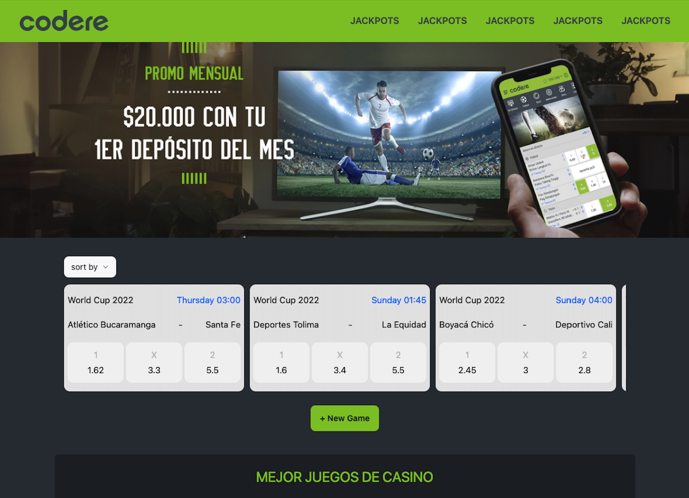

<!-- Improved compatibility of back to top link: See: https://github.com/othneildrew/Best-README-Template/pull/73 -->

<a name="readme-top"></a>

<!--
*** Thanks for checking out the Best-README-Template. If you have a suggestion
*** that would make this better, please fork the repo and create a pull request
*** or simply open an issue with the tag "enhancement".
*** Don't forget to give the project a star!
*** Thanks again! Now go create something AMAZING! :D
-->

<!-- PROJECT SHIELDS -->
<!--
*** I'm using markdown "reference style" links for readability.
*** Reference links are enclosed in brackets [ ] instead of parentheses ( ).
*** See the bottom of this document for the declaration of the reference variables
*** for contributors-url, forks-url, etc. This is an optional, concise syntax you may use.
*** https://www.markdownguide.org/basic-syntax/#reference-style-links
-->

[![LinkedIn][linkedin-shield]][linkedin-url]

<!-- PROJECT LOGO -->
<br />
<div align="center">
    
  <h3 align="center">Gambling Front </h3>

</div>

<!-- ABOUT THE PROJECT -->

## About The Project

An app I wrote with React,His goal is to get information about gamebling .[ Take a look, it's Here!](https://angulik.onrender.com)

</a>

#### Table of Contents

  <ul>
    <li>
      <a href="#about-the-project">About The Project</a>
    </li>
    <li>
      <a href="#getting-started">Getting Started</a>
    </li>
    <li><a href="#description">Description</a></li>
    <li><a href="#contact">Contact</a></li>
    <li><a href="#showcase">Showcase</a></li>
  </ul>

### Built With

- [![React][React.io]][React-url]
- [![TypeScript][TypeScript.com]][TypeScript-url]
- [![Sass][Sass.com]][Sass-url]

<p align="right">(<a href="#readme-top">back to top</a>)</p>

<!-- GETTING STARTED -->

## Getting Started

### Installation

1. Clone the repo

   ```sh
    git clone https://github.com/eldadYikne/gambling-front.git

   ```

2. Install NPM packages
   ```sh
   npm install
   ```
3. Open the terminal and enter the following line

   ```js
   npm run dev
   ```

<p align="right">(<a href="#readme-top">back to top</a>)</p>

<!-- USAGE EXAMPLES -->

## Description

I want to keep expanding my knowladge and try new chalanges. That was my motivation.

And a bit about the project - a small App that was built in a one day.

#### Technologies

- React
- React-Router
- Sass
- Bootstrap
- React CLI & Github pages
<p align="right">(<a href="#readme-top">back to top</a>)</p>

<!-- CONTACT -->

## Contact

Eldad yikne - [Linkedin](https://www.linkedin.com/404/) - eldadykn@gmail.com

Project Link: [https://angulik.onrender.com](https://angulik.onrender.com)

<p align="right">(<a href="#readme-top">back to top</a>)</p>

<!-- ACKNOWLEDGMENTS -->

## Mobile full responsive


<p align="right">(<a href="#readme-top">back to top</a>)</p>

<!-- MARKDOWN LINKS & IMAGES -->
<!-- https://www.markdownguide.org/basic-syntax/#reference-style-links -->
